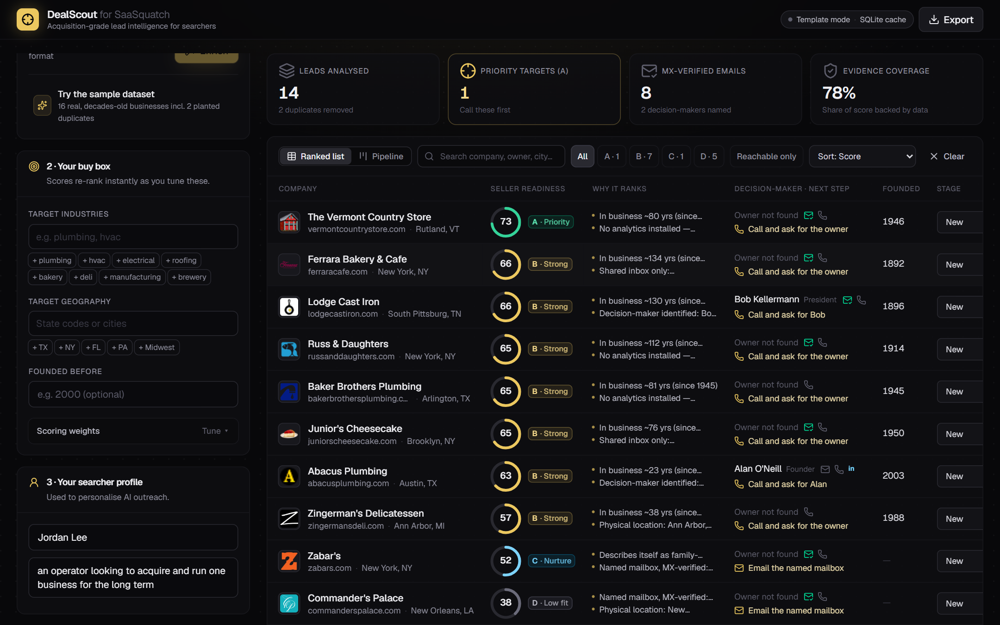
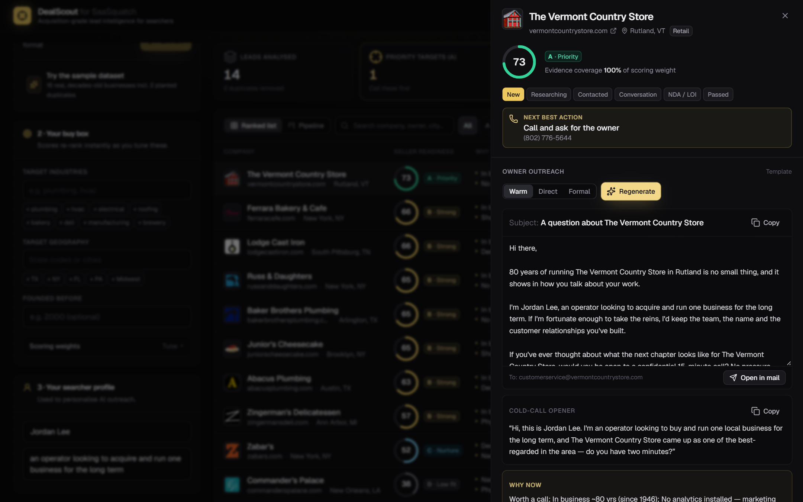
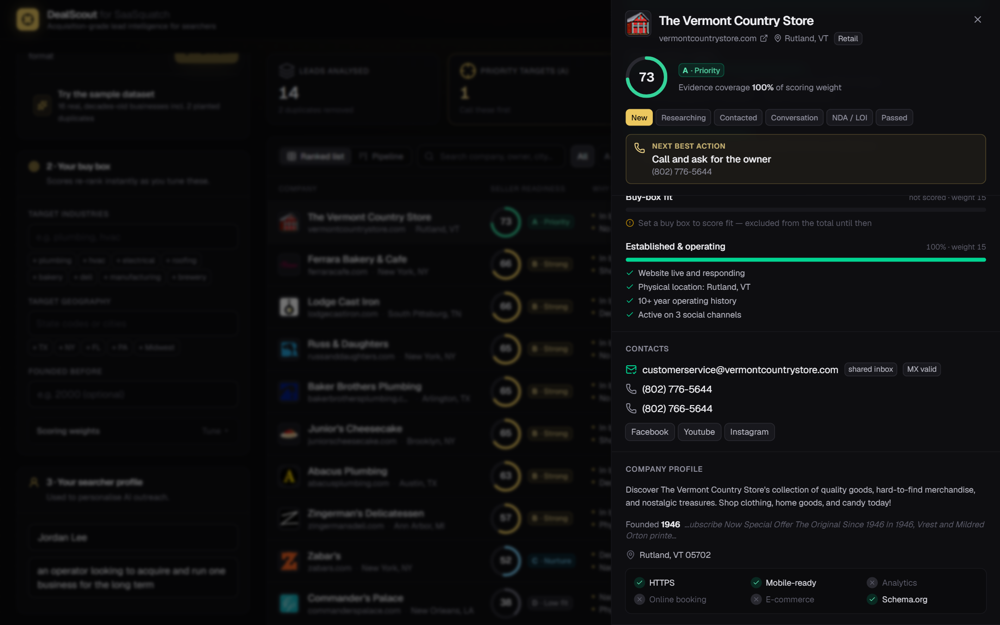
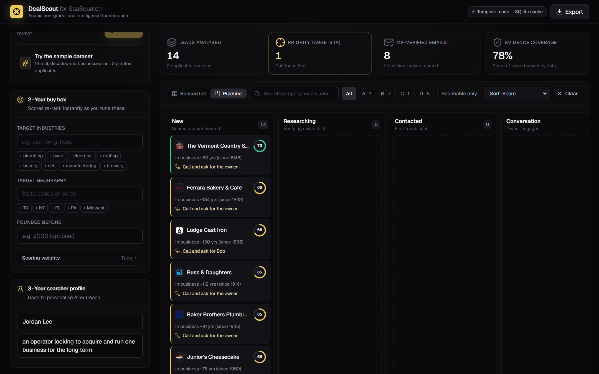
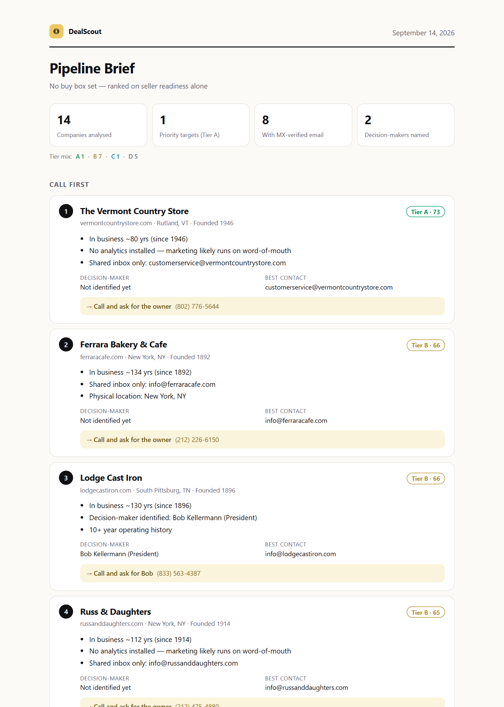
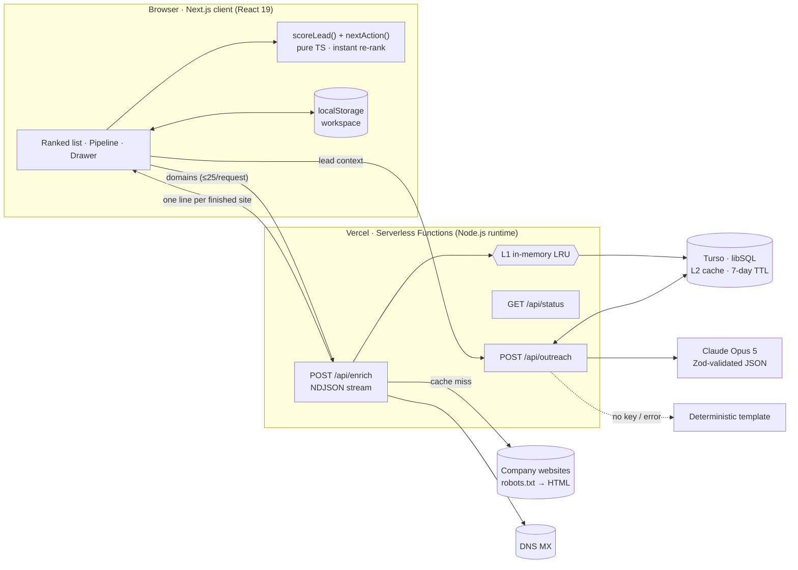

<div align="center">


# DealScout

### Acquisition-grade lead intelligence for SaaSquatch

**SaaSquatch finds companies. DealScout tells a searcher which owners to call first, who to ask for, what to say, and what they'd improve after buying.**

[](https://nextjs.org)
[](https://react.dev)
[](https://www.typescriptlang.org)
[](https://tailwindcss.com)
[](https://www.anthropic.com)
[](https://turso.tech)
[](https://vercel.com)
[](#8-quality)

**[▶ 2-minute walkthrough](https://www.capcut.com/sv2/ZS9SnNPBhuJ9G-dpAjg/)** · **[🌐 Live demo](https://dealscout-blond.vercel.app)** · **[🔌 API demo](#9-api-demonstration)** · **[📊 Sample report](docs/sample-pipeline-brief.html)**

</div>



---

## TL;DR for reviewers

| | |
|---|---|
| **Problem** | SaaSquatch's core users are *searchers* buying one small business. Their bottleneck isn't finding more companies. It's knowing **which owner is ready to sell, how to reach them, and why the business is worth buying**. |
| **Approach** | *Quality First* (handbook rule 2): make SaaSquatch's lead list **decision-ready** instead of adding more scraped rows. |
| **What it does** | Live website enrichment → dedupe → MX-verified contacts → an **explainable Seller-Readiness Score** → a **next best action** per lead → Claude-drafted owner outreach → pipeline board and **HubSpot / Salesforce / Pipeline Brief** exports. |
| **Why it fits Caprae** | It scores **post-acquisition value-creation upside**: Caprae's thesis that most value is created *after* the deal, over a seven-year journey. |
| **Proof** | On 16 real businesses: both planted duplicates removed, 12/14 sites enriched (the 2 bot-protected sites were flagged, not forced), founding years recovered for 8 of 12 with source quotes, 8 companies with MX-verified email, all 14 cold sites crawled in **~20 s**, cached re-runs in **under 1 s**. **37 tests**, strict TypeScript, clean lint and production build. |

## Contents

1. [Analysing SaaSquatch](#1-analysing-saasquatch)
2. [What DealScout adds](#2-what-dealscout-adds)
3. [The Seller-Readiness Score](#3-the-seller-readiness-score)
4. [UX design decisions](#4-ux-design-decisions)
5. [Architecture](#5-architecture)
6. [Data quality, resilience and ethics](#6-data-quality-resilience-and-ethics)
7. [Results on real data](#7-results-on-real-data)
8. [Quality](#8-quality)
9. [API demonstration](#9-api-demonstration)
10. [Run it locally](#10-run-it-locally)
11. [Deploy (Vercel + Turso)](#11-deploy-vercel--turso)
12. [How this maps to the evaluation criteria](#12-how-this-maps-to-the-evaluation-criteria)
13. [Limitations and roadmap](#13-limitations-and-roadmap)

---

## 1. Analysing SaaSquatch

*Based on the public product page and launch announcement.*

**Business purpose.** SaaSquatch is Caprae's in-house lead-generation platform and the primary sourcing tool behind its Search-as-a-Service offer. It gives searchers, cold callers, students and operators one affordable tool (a single ~$20/month plan at launch) in place of a stack of expensive data subscriptions. It reached 1,200+ signups during a three-week beta.

| Strengths | Gaps for the searcher workflow (what DealScout targets) |
|---|---|
| Aggregates Apollo, LinkedIn, Crunchbase, Google Maps and Growjo | Results are sorted by **firmographics**, not by **likelihood the owner will sell** |
| Fast filters by industry, location and employee count | A company contact is rarely the **owner**, and small-business sites are dominated by `info@` inboxes |
| CSV export and AI email tooling | No **explanation** of why a lead matters, which makes it hard to prioritise or trust |
| Built for the exact audience Caprae serves | Sales-style outreach doesn't suit a sensitive conversation about **someone's life's work** |
| One simple, cheap plan | No **post-acquisition lens**, the thing a searcher (and Caprae) actually underwrites |

**Conclusion:** the highest-leverage improvement isn't *more* data. It's turning the data SaaSquatch already produces into a **ranked, verified, explainable call list** with a ready-to-send first touch.

## 2. What DealScout adds

| Step | What happens | Why it matters |
|---|---|---|
| **Source** | Paste domains/URLs/emails, drop a SaaSquatch or CRM CSV (columns auto-detected), or load the sample set | Sits on top of the existing SaaSquatch export, so there's nothing new to learn |
| **Dedupe** | Canonical registrable domain (`https://www.acme.com/about` → `acme.com`, multi-part TLDs, hosted builders), plus a fuzzy company key (`"The Acme Co., LLC"` ≡ `"Acme"`) | No double-calling the same owner, and less noise |
| **Enrich (live)** | Crawls the homepage and up to 3 high-signal subpages. Reads **schema.org JSON-LD**, `mailto:`/`tel:`, **Cloudflare-obfuscated emails**, `name [at] domain [dot] com` text. Fingerprints **38 technologies**. Extracts founding year, owner/founder names, address, socials, and "family-owned" / "third generation" language | Signals that simple scrapers miss |
| **Validate** | Email syntax, disposable-domain filter, **DNS MX lookup**, and mailbox classification: *named* (`bill@`), *personal* (Gmail, often the owner) or *shared* (`info@`, `feedback@`) | Fewer bounces, and you reach the owner rather than the front desk |
| **Score** | Explainable **Seller-Readiness Score** (0–100, Tiers A–D). Every point shows its evidence and what's missing | Rankings a searcher can trust and act on |
| **Next best action** | Per lead, for example *Call and ask for Bob* (Lodge Cast Iron's President) · *Email the named mailbox* (`bill@penzeys.com`) · *Identify the owner on LinkedIn* · *Verify manually* | Removes the "now what?" step |
| **Tune** | Buy box (industries, geography, founded-before) and weight sliders re-rank everything **instantly** on the client | Adapts to each searcher's thesis |
| **Reach out** | Claude drafts an owner email, a cold-call opener, a *why-now* note, **3 post-close value-creation ideas** and **3 first-call questions**, in a warm, direct or formal tone | From a row in a list to a first conversation |
| **Work and report** | Drag-and-drop pipeline (New → Researching → Contacted → Conversation → NDA/LOI → Passed), notes, and one-click **Pipeline Brief** (a shareable one-page report), **HubSpot**, **Salesforce** or full CSV exports | Plugs into the existing sales workflow and CRM |

<table>
<tr>
<td width="50%"><br/><sub><b>Owner outreach:</b> email, call opener, why-now and a value-creation plan</sub></td>
<td width="50%"><br/><sub><b>Explainable scoring:</b> evidence ✓ and missing data ⚠ for every factor</sub></td>
</tr>
<tr>
<td width="50%"><br/><sub><b>Pipeline:</b> drag leads through stages, with the next step on every card</sub></td>
<td width="50%"><br/><sub><b>Pipeline Brief:</b> an automated, shareable, print-ready report</sub></td>
</tr>
</table>

## 3. The Seller-Readiness Score

| Factor | Default weight | Signals |
|---|---|---|
| **Succession pressure** | 30 | Years in business, "family-owned", generational or retirement language |
| **Value-creation upside** | 20 | No analytics, no online booking or checkout, stale copyright year, not mobile-ready, DIY site builder, no HTTPS. *Each gap is a post-close win.* |
| **Owner reachability** | 20 | Named decision-maker, MX-verified named or personal mailbox, direct phone, LinkedIn |
| **Buy-box fit** | 15 | Target industry keywords, geography, founded-before cutoff |
| **Established & operating** | 15 | Live site, physical address, 10+ year history, social presence |

- **No reward for missing data.** Unknown factors count at a conservative 30% prior, so thin data can't carry a lead to the top.
- **Not configured is not the same as unknown.** Buy-box fit is left out of the total until the user sets a buy box, rather than penalising every lead.
- **Evidence coverage** reports the share of the score that is backed by real data.
- **Highlights skip table stakes.** "Site is live" never appears as a reason to call.

## 4. UX design decisions

| Decision | Why |
|---|---|
| **Zero setup** | No login, a one-click sample dataset and a local workspace, so a reviewer or searcher gets value in under 10 seconds |
| **Results stream in** | Rows fill in as each site finishes (NDJSON) instead of showing a spinner until the slowest site answers |
| **Progressive disclosure** | The table shows the *two* strongest reasons plus the next step. The drawer holds the full evidence, contacts, profile and outreach |
| **Evidence-first, always** | Every score shows ✓ evidence and ⚠ missing data. Every founding year shows the quote it came from. Trust drives adoption |
| **Instant re-ranking** | Scoring is a pure client-side function, so buy-box and weight changes re-rank the whole list with no server round-trip |
| **Next best action everywhere** | Table, drawer, pipeline cards and exports all answer "what do I do now?" |
| **Colour carries meaning** | Tier colours (emerald A, gold B, sky C, grey D), emerald for verified contacts, amber for missing or blocked data. The dark ink and gold palette nods to Caprae's brand |
| **Fits existing workflows** | CSV in with auto-mapped columns; HubSpot, Salesforce and CSV out; a printable brief for partners and investors |
| **Honest failure states** | Blocked or unreachable sites are labelled *"flagged for manual review"*, never silently dropped. Without an AI key the app still works in template mode |
| **Accessible and responsive** | Keyboard (`Esc` closes the drawer), focus rings, ARIA labels on icon-only indicators, and no horizontal overflow at 400 px width |

## 5. Architecture



### Exact stack

| Layer | Technology (version) | Why |
|---|---|---|
| Framework | **Next.js 16.3** (App Router, Turbopack), **React 19.2**, **TypeScript 5** (strict) | One codebase for UI and API; route handlers deploy as serverless functions |
| Styling | **Tailwind CSS 4**, lucide-react icons, Geist font | Fast, consistent design system |
| Scraping | Native `fetch` (undici) + **cheerio 1.2**; custom RFC 9309 robots.txt matcher; `node:dns` | Light enough for serverless: no headless browser, cold starts stay small |
| AI | **Anthropic SDK 0.125** → `claude-opus-5`, **Zod 4** structured outputs (`messages.parse`), server-side refusal fallback | Schema-valid JSON, so the UI never parses free text |
| Database | **libSQL** via `@libsql/client` 0.18: **Turso** in production, a local SQLite file (OS temp directory) in development | Same driver and SQL everywhere; zero-setup local dev; HTTP protocol suits serverless |
| CSV | **PapaParse 5.7** | Robust quoting and encoding on import and export |
| Tests | **Vitest 5**, ESLint 9, `tsc --noEmit`, live smoke-crawl script | |

### Data storage strategy

| Data | Where | Why |
|---|---|---|
| Enrichment results | Turso table `enrichment_cache_v2` (domain PK, JSON, `fetched_at`), with a 7-day TTL. The table name is versioned so extraction changes invalidate stale data | Public web data is shared across users, so caching it is cheap and fast |
| Claude drafts | Turso table `outreach_cache`, keyed by the SHA-256 of model + domain + tone + sender + signals | Identical requests are never billed twice |
| Workspace (leads, stages, notes, buy box) | Browser `localStorage` | Private per user by default, no auth needed for a demo. Moves to per-tenant Turso DBs with auth (see roadmap) |

### Caching and performance

- **Two-tier cache:** an L1 per-instance LRU (500 entries) sits in front of L2 Turso. A cache outage is caught and logged, and never breaks enrichment.
- **Streaming:** `/api/enrich` returns NDJSON, so time to first result is roughly the fastest site rather than the slowest.
- **Bounded concurrency:** 6 sites in parallel per request, 12 per client batch, and at most 25 per request (server-enforced).
- **Hard limits per site:** an 8 s timeout per page, a 1.5 MB HTML cap, the homepage plus at most 3 subpages, a retry only for transient socket errors (never for timeouts), and https → www → http fallback.
- **Client-side scoring:** re-ranking hundreds of leads costs zero network.
- **Static shell:** `/` is prerendered to the CDN, and only `/api/*` runs on demand.

### Hosting, cloud and deployment

| | |
|---|---|
| **Hosting model** | **Hybrid.** Static prerendered page on Vercel's edge CDN, plus **serverless functions** (Node.js runtime, `maxDuration` 60 s) for `/api/enrich`, `/api/outreach` and `/api/status` |
| **Cloud provider** | **Vercel**, which runs on **AWS** infrastructure; **Turso** for the managed libSQL database; the **Anthropic API** for Claude |
| **Deployment process** | Git push to `main` → Vercel builds (`next build`, Turbopack) → atomic deploy with instant rollback. Pull requests get preview URLs. Secrets live in Vercel environment variables. Database tables are created automatically on first request |

## 6. Data quality, resilience and ethics

- **Deduplication:** domain canonicalisation plus a fuzzy company-name key, within a batch and against the existing workspace.
- **Validation:** email syntax, disposable-domain filter, DNS MX, and named / personal / shared classification. Named mailboxes that look like a person (`bill@`) rank above functional ones (`mystorevisit@`).
- **Enrichment across complex web structures:** JSON-LD `@graph` flattening, Cloudflare email decoding, obfuscated-text emails, street-fragment cleanup in addresses, and domain-matched company names from noisy `<title>` tags.
- **Adapting to changing sites:** multiple independent extractors (structured data, links, text patterns) mean a redesign rarely breaks all of them at once.
- **CAPTCHAs and IP restrictions: detected, never bypassed.** WAF challenges and HTTP 401/403/405/429 are reported as *"flagged for manual review"*. On the sample set, Katz's Deli returns HTTP 405 to bots, and Michael & Son's firewall started challenging the crawler after a day of repeated test runs. DealScout reports both plainly and moves on.
- **Respectful crawling:** an honest User-Agent (`DealScoutBot/1.0 … respects robots.txt`), full **robots.txt** compliance, bounded concurrency, and no SMTP mailbox probing.
- **Security:** website text is passed to Claude as *untrusted data* inside tags (a prompt-injection guard); exports are sanitised against **CSV formula injection**; the report HTML is fully escaped.

## 7. Results on real data

Measured on the included sample of 16 real, publicly listed US businesses (founded 1892–2003). The screenshots and [`docs/sample-pipeline-brief.html`](docs/sample-pipeline-brief.html) come from this same run.

| Metric | Result |
|---|---|
| Duplicates removed | **2 of 2 planted**: one by domain (`www.` variant), one by fuzzy company name (`Russ and Daughters, LLC`) |
| Sites enriched | **12 / 14** unique companies. The other 2 are bot-protected and were flagged for manual review, not forced |
| Founding year recovered | **8 / 12**, each with its source quote (e.g. *"Serving the Greater Dallas / Fort Worth Metroplex Since 1945"*) |
| Companies with an MX-verified email | **8** |
| Decision-makers named | **2**: Lodge Cast Iron's President and Abacus Plumbing's Founder |
| Average evidence coverage | **78%** of scoring weight backed by data |
| Cold crawl, all 14 sites through the app | **19.6 s** end to end (6 in parallel, up to 4 pages each) |
| Warm re-run, 14 leads (cache hit) | **0.4 s** |

> **Live data varies from run to run.** Websites change, time out and rate-limit. In earlier runs the same set enriched 13/14, with Stew Leonard's founding year (1969) and president also found. Those details sit on subpages that sometimes time out under load. Failed crawls never overwrite good cached data, and the per-lead **Re-crawl** button retries on demand.

## 8. Quality

```
npm test          # 37 unit tests: domain canonicalisation, dedupe, robots.txt, HTML extraction,
                  # email classification, scoring, next-best-action, CSV import/export, report escaping
npm run typecheck # strict TypeScript
npm run lint      # ESLint (Next.js + React hooks rules)
npm run smoke -- lodgecastiron.com penzeys.com   # live crawl from the terminal
```

## 9. API demonstration

The enrichment and outreach engines are plain HTTP APIs, so they can be used from any tool, CRM workflow or notebook.

**Enrich domains** (streams one JSON line per company as soon as it's done):

```bash
curl -N -X POST http://localhost:3000/api/enrich \
  -H "Content-Type: application/json" \
  -d '{"domains":["lodgecastiron.com","https://www.russanddaughters.com/about"]}'
```

```jsonc
{"domain":"lodgecastiron.com","cached":false,"ms":3518,"enrichment":{
  "ok":true,"name":"Lodge Cast Iron","foundedYear":1896,
  "foundedEvidence":"…quality cast iron cookware in Tennessee since 1896…",
  "people":[{"name":"Bob Kellermann","title":"President","source":"https://www.lodgecastiron.com/…"}],
  "emails":[{"address":"info@lodgecastiron.com","kind":"role","mx":"valid","onDomain":true}],
  "phones":["(833) 563-4387"],"socials":{"facebook":"…","instagram":"…","youtube":"…","x":"…"},
  "tech":["Shopify","Google Analytics","Google Tag Manager","Hotjar", "…"],
  "flags":{"https":true,"mobileViewport":true,"analytics":true,"ecommerce":true, "…":"…"}}}
```

**Draft owner outreach:**

```bash
curl -X POST http://localhost:3000/api/outreach \
  -H "Content-Type: application/json" \
  -d '{"domain":"lodgecastiron.com","company":"Lodge Cast Iron","ownerName":"Bob Kellermann",
       "foundedYear":1896,"signals":["In business ~130 yrs (since 1896)"],"gaps":[],
       "sender":{"name":"Jordan Lee","background":"an operator looking to acquire one business"},"tone":"warm"}'
```

Returns `{ draft: { subject, email, callOpener, whyNow, valueCreationIdeas[3], diligenceQuestions[3], source, model } }`.

**Configuration status:** `GET /api/status` → `{ "ai": true, "model": "claude-opus-5", "database": "turso" }`

## 10. Run it locally

**Prerequisites:** Node.js 20+ (developed on Node 22).

```bash
git clone https://github.com/MuhammadTalhakhan2003/dealscout.git && cd dealscout
npm install
cp .env.example .env.local     # optional: add ANTHROPIC_API_KEY for Claude drafting
npm run dev                    # http://localhost:3000 → "Run it on the sample dataset"
```

| Variable (all optional) | Effect when unset |
|---|---|
| `ANTHROPIC_API_KEY` | Outreach uses the deterministic template (the header shows "Template mode") |
| `TURSO_DATABASE_URL`, `TURSO_AUTH_TOKEN` | A local SQLite cache file in the OS temp directory (ephemeral `/tmp` on Vercel). It's kept out of the project folder deliberately: sync tools like OneDrive and Dropbox lock the file and stall SQLite's synchronous local driver |

**Dataset:** `src/lib/sample.ts` holds the 16-company sample, including 2 planted duplicates. `public/sample-saasquatch-export.csv` is a SaaSquatch-style CSV with a duplicate row and a row with no website, to show column mapping, dedupe and skip handling. `docs/sample-pipeline-brief.html` is a report generated from it.

## 11. Deploy (Vercel + Turso)

```bash
# 1. Database (free tier)
turso db create dealscout
turso db show dealscout --url          # → TURSO_DATABASE_URL
turso db tokens create dealscout       # → TURSO_AUTH_TOKEN

# 2. App
vercel link
vercel env add ANTHROPIC_API_KEY
vercel env add TURSO_DATABASE_URL
vercel env add TURSO_AUTH_TOKEN
vercel --prod
```

## 12. How this maps to the evaluation criteria

| Criterion | Where it's addressed |
|---|---|
| **Business use case (10)** | Built for SaaSquatch's real persona (searchers) and Caprae's post-acquisition thesis. Prioritises high-impact leads (Tiers, next best action), minimises irrelevant data (dedupe, functional-inbox detection, table-stakes evidence hidden), and fits sales workflows (CSV in; HubSpot, Salesforce and Brief out). Goes beyond scraping to actionable insight: why-now, value-creation ideas, first-call questions |
| **UX/UI (10)** | Zero-setup onboarding, streaming progress, progressive disclosure, instant re-ranking, guided filtering, verification and export flows, and a next best action on every lead. See [§4](#4-ux-design-decisions) |
| **Technicality (10)** | Multi-source extraction (JSON-LD, links, text, Cloudflare decoding), dedupe, enrichment and MX validation, bounded concurrency with streaming and two-tier caching, robots.txt compliance, graceful handling of CAPTCHAs, WAFs and IP blocks, 37 tests. See [§5](#5-architecture)–[§7](#7-results-on-real-data) |
| **Design (5)** | A cohesive ink-and-gold system; tier colour semantics; score rings; evidence ticks and warnings; responsive down to 400 px |
| **Other (5)** | Automated reporting (Pipeline Brief), CRM integrations (HubSpot and Salesforce presets), unique filtering (buy box, tiers, "reachable only"), ethical collection, sales-strategy insights, an API demo, and this documentation |

## 13. Limitations and roadmap

**Known limitations**
- Founding-year extraction can pick up a date that belongs to a partner organisation. For example, Zingerman's Deli shows *1988* taken from a food-rescue programme mentioned on its site, while the deli dates from 1982. That's exactly why every extracted value shows its source quote.
- Owner names appear on only a minority of small-business websites, so reachability often depends on the next-best-action research steps.
- JavaScript-only websites (no server-rendered HTML) yield fewer signals, because there's no headless browser by design.

**Roadmap**
1. **Owner-age and entity data** from Secretary of State filings (entity age, officers, registered agent), the strongest succession signal.
2. **Native SaaSquatch integration:** score inside the SaaSquatch results table and write scores back.
3. **Queue-based crawling** (Vercel Queues or Inngest) for 10k-row lists, with per-domain rate limits and an optional headless fallback.
4. **Team workspaces:** auth, a Turso database per tenant, and direct HubSpot and Salesforce API sync.
5. **Learning weights** from which leads actually converted into conversations and LOIs.

<details>
<summary><b>Project layout</b></summary>

```
src/
  app/api/enrich/route.ts    streaming enrichment endpoint (NDJSON)
  app/api/outreach/route.ts  Claude drafting + cache + template fallback
  app/api/status/route.ts    configuration status for the UI
  lib/crawler.ts             fetch, robots.txt, subpage selection, merge
  lib/extract.ts             HTML → facts (JSON-LD, emails, phones, people, tech…)
  lib/verify.ts              email validation, classification, MX
  lib/score.ts               explainable scoring + next best action
  lib/cache.ts               L1 memory + L2 libSQL/Turso
  lib/outreach.ts            Claude structured outputs + template fallback
  lib/report.ts              Pipeline Brief (self-contained HTML report)
  lib/csv.ts                 CSV import mapping + HubSpot/Salesforce export
  components/                app shell, table, pipeline, drawer, panels
tests/                       Vitest suites
scripts/smoke-crawl.ts       live crawl from the terminal
docs/                        screenshots + sample report
```
</details>

---

<div align="center">
<sub>Built by <b>Muhammad Talha</b> for the Caprae Capital AI-Readiness Challenge · <a href="LINKEDIN_URL">LinkedIn</a> · <a href="mailto:EMAIL">Email</a></sub>
</div>
